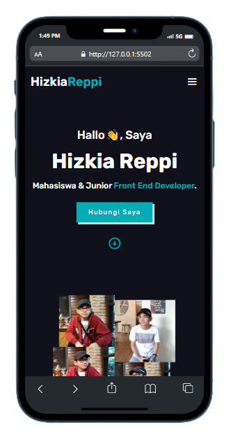

# Belajar Dasar Pemograman Web - Dicoding

Kelas Belajar Dasar Pemograman Web | Alur Belajar Front-End Web Developer | Dicoding

Kelas ini membahas mengenai pembuatan struktur website dengan HTML, memperindah tampilan website dengan CSS, manipulasi DOM serta BOM menggunakan Javascript, dan web storage dalam membuat website yang memiliki fungsionalitas lebih dan interaktif.

Materi yang dipelajari dikelas ini:

- **HTML** : Membahas tentang Struktur dasar HTML, paragraf, heading, gambar, list, format teks, struktur layout dasar menggunakan elemen dengan pendekatan semantic HTML.
- **CSS** : Membahas tentang macam-macam tipe selector, formatting text, bermain dengan warna, mengenal apa itu box model, positioning, penyusunan layout pada website menggunakan teknik floating, penyusunan layout website menggunakan Flexbox.
- **JavaScript Basic dan Manipulasi DOM** : Mengetahui JavaScript dan Manipulasi DOM, mengenal variabel, fungsi operator, perulangan dan hal lainnya. Kita juga akan belajar bagaimana memanipulasi elemen menggunakan syntax JavaScript, menampilkan alert dan mengetahui fungsi - fungsi dari Web API yang ada seperti document, window dan sebagainya.
- **Web Storage** : Mengenal apa itu Web Storage, dan tipe-tipe Web Storage

## Submission

Pada submission kelas ini, saya membuat website Portfolio sederhana dengan menggunakan HTML, CSS dan sedikit JavaScript, serta telah membuat website menjadi responsif di tampilan mobile

<a href="https://www.hizkiareppi.skom.id/">Demo</a>

Create with ❤ | Hizkia Reppi
